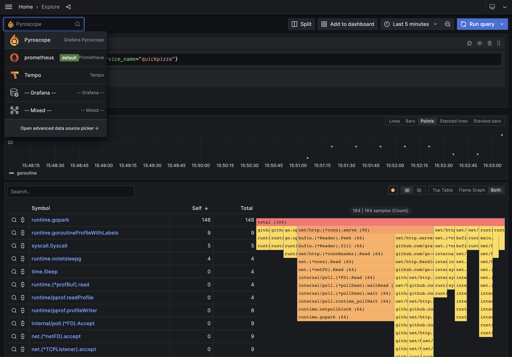

# QuickPizza


## What is QuickPizza? 🍕🍕🍕

`QuickPizza` is a web application, used for demonstrations and workshops, that generates new and exciting pizza combinations! 

The app is built using [SvelteKit](https://kit.svelte.dev/) for the frontend and [Go](https://go.dev/) for the backend.

The tests written for `QuickPizza` demonstrates the basic and advanced functionalities of k6, ranging from a basic load test to using different modules and extensions.

## Requirements

- [Docker](https://docs.docker.com/get-docker/)
- [Grafana k6](https://k6.io/docs/get-started/installation/) (v.0.46.0 or higher)

## Run locally with Docker

To run the app locally with Docker, run the command:

```bash
docker run --rm -it -p 3333:3333  ghcr.io/grafana/quickpizza-local:latest
```

or build image from the repo:

```bash
docker run --rm -it -p 3333:3333 $(docker build -q .)
```

That's it!

Now you can go to [localhost:3333](http://localhost:3333) and get some pizza recommendations!

## Using k6 to test it

All tests live in the `k6` folder. Within this folder, you will find the following folders:

- [foundations](k6/foundations/) - covers the basic functionalities of k6.
- [browser](k6/browser/) - covers a more deep-dive look on how to use the [k6 browser module](https://k6.io/docs/using-k6-browser/overview/) for browser and web performance testing.
- [disruptor](k6/disruptor/) - covers a more deep-dive look on how to use [xk6-disruptor](https://k6.io/docs/javascript-api/xk6-disruptor/) for failure injection testing.
- [advanced](k6/advanced) - covers tests that are more advanced such as hybrid tests, tracing, etc.

To run tests on the `foundations` folder, you can use the following commands:

```bash
cd k6/foundations
k6 run 01.basic.js
```

If you want to run one iteration with one virtual user, you can use the following command:

```bash
k6 run --iterations 1 --vus 1 01.basic.js
```

If QuickPizza is [available remotely](#deploy-the-docker-image), then pass the hostname and port through the `BASE_URL` environment variable as follows:

```bash
k6 run -e BASE_URL=https://acmecorp.dev:3333 01.basic.js
```

If the test uses an extension, you need to build it first via xk6. To build the extension using Docker, you can run the following command:

```bash
cd k6/foundations/extension

docker run --rm -e GOOS=darwin -u "$(id -u):$(id -g)" -v "${PWD}:/xk6" \
  grafana/xk6 build  \
  --with xk6-internal=.
```

Note that the `GOOS` variable is for Mac. Please refer to [Build a k6 binary using Docker](https://k6.io/docs/extensions/guides/build-a-k6-binary-using-docker/) for more information.

To run the test that uses an extension, you can run the following command:

```bash
./extension/k6 run 11.extension.js
```

## Collecting telemetry

Testing something you can't observe is only half the fun. QuickPizza is instrumented using best practices to record logs, emit metrics, traces and allow profiling. You can either collect and [store this data locally](#local-setup) or send it to [Grafana Cloud](#grafana-cloud).

### Local Setup

[docker-compose-local.yaml](./docker-compose-local.yaml) is set up to run the QuickPizza, Grafana, Tempo, Prometheus, Pyroscope, and Grafana Agent containers.

The Grafana Agent collects observability data from the QuickPizza app and forwards it to the Tempo, Prometheus, and Pyroscope services. Then, you can visualize and correlate the data with the local Grafana instance.

To start the local environment, use the following command:

```bash
docker compose -f docker-compose-local.yaml up -d --build
```

Like before, Quickpizza is available at [localhost:3333](http://localhost:3333). You can now visit [localhost:3000](http://localhost:3333) to access the Grafana instance.



Please refer to [agent-local.river](./contrib/agent-local.river) to find the labels applied to the telemetry data.

### Grafana Cloud

To send telemetry collected from a local instance to Grafana Cloud, use the [agent-cloud.river](./contrib/agent-cloud.river) configuration file. The following command can be used to start the agent with the configuration file using docker:

```bash
docker run --name grafana-agent --rm -i \
  --network quickpizza \
  -v ./contrib/agent-cloud.river:/grafana-agent.river:Z \
  -e GRAFANA_CLOUD_STACK="<your cloud stack name>" \
  -e GRAFANA_CLOUD_TOKEN="<your grafana cloud token>" \
  -e QUICKPIZZA_HOST="quickpizza:3333" \
  -e AGENT_MODE=flow \
  grafana/agent run /grafana-agent.river
```

For this to work, make sure that:
* The quickpizza container runs in the same network as the agent
* The [Access Policy](https://grafana.com/docs/grafana-cloud/account-management/authentication-and-permissions/access-policies/) of your token includes the following scopes for the specified Grafana Cloud Stack: `stacks:read`, `metrics:write`, `logs:write`, `traces:write`, and `profiles:write`. See [the autoconfigure module](https://github.com/grafana/agent-modules/tree/main/modules/grafana-cloud/autoconfigure) for more information.

Afterwards, you can start the quickpizza container and supply it with the required configuraiton to enable tracing:

```bash
docker run --name quickpizza --rm -i -p 3333:3333 \
  --network quickpizza \
  -e QUICKPIZZA_OTLP_ENDPOINT=http://grafana-agent:4318 \
  -e QUICKPIZZA_TRUST_CLIENT_TRACEID=1 \
  ghcr.io/grafana/quickpizza-local:latest
```

#### Enable Grafana Faro

> NOTE: Frontend observability is only available in Grafana Cloud

To enable Grafana Faro and monitor frontend observability, stop the QuickPizza container if it's already running and set `QUICKPIZZA_CONF_FARO_URL` to your Faro web URL:

```bash
export QUICKPIZZA_CONF_FARO_URL="<your faro url>"
docker run --rm -it -p 3333:3333 -e QUICKPIZZA_CONF_FARO_URL ghcr.io/grafana/quickpizza-local:latest
```


## Deploy application to Kubernetes

If you want to run a test that uses xk6-disruptor, or want to experiment with distributed tracing, you will need to deploy QuickPizza to Kubernetes. This section explains how to deploy QuickPizza to a local Kubernetes cluster using [minikube](https://minikube.sigs.k8s.io/docs/start/), which you can run on your own machine if you use Linux, MacOS, or Windows.

Minikube is available in the software distribution channel for your OS of choice: `apt` or similar for Linux, `brew` for macOS, and `winget` or chocolatey for Windows. For more details on how to install Minikube, you can check the "Installation" section on the [Minikube documentation](https://minikube.sigs.k8s.io/docs/start/).

We recommend that you use the latest version of Kubernetes available. We have verified the following instructions for kubernetes 1.19 and above. Keep in mind that `xk6-disruptor` requires Kubernetes 1.25 or above.

After installing minikube, you can start a local cluster with the following command:

```bash
minikube start
```

To deploy the application, run: 

```bash
kubectl apply -k kubernetes/
```

The `kubernetes/kustomization.yaml` file contains some commented lines that, if enabled, will configure tracing for the quickpizza app. Feel free to uncomment those lines and input your OTLP credentials if you want this functionality.

When deployed in Kubernetes, the QuickPizza manifests locates in `./kubernetes` will deploy a number of different pods, each one being a microservice for the application:

```
kubectl get pods

NAME                                  READY   STATUS    RESTARTS   AGE
quickpizza-catalog-749d46c785-4q6s5   1/1     Running   0          7s
quickpizza-copy-7f879947c5-rslhg      1/1     Running   0          7s
quickpizza-frontend-bf447c76-9nb8f    1/1     Running   0          7s
quickpizza-recs-644d498964-6l48p      1/1     Running   0          7s
quickpizza-ws-7d444d9cd6-mkkmd        1/1     Running   0          7s
```

You should also see a bunch of services associated with these pods:

```
kubectl get services

NAME                  TYPE           CLUSTER-IP       EXTERNAL-IP   PORT(S)          AGE
kubernetes            ClusterIP      10.96.0.1        <none>        443/TCP          1s
quickpizza-catalog    ClusterIP      10.104.201.242   <none>        3333/TCP         6s
quickpizza-copy       ClusterIP      10.97.255.59     <none>        3333/TCP         6s
quickpizza-frontend   LoadBalancer   10.99.177.165    <pending>     3333:30333/TCP   6s
quickpizza-recs       ClusterIP      10.103.37.197    <none>        3333/TCP         6s
quickpizza-ws         ClusterIP      10.106.51.76     <none>        3333/TCP         6s
```

A service of particular interest is `quickpizza-frontend`, of type `LoadBalancer`. This is the service we need to access in our browser to reach the application. You should see that the external IP for this service is currently `<pending>`. In order to make it reachable from outside the cluster, we need to [expose it](https://k6.io/docs/javascript-api/xk6-disruptor/get-started/expose-your-application/). To do this with minikube, open another terminal window and run:

```bash
minikube tunnel
```

The command will stay running in the foreground, forwarding traffic to the cluster.

The external IP should now be assigned:

```bash
kubectl get services

NAME                  TYPE           CLUSTER-IP       EXTERNAL-IP     PORT(S)          AGE
quickpizza-frontend   LoadBalancer   10.99.177.165    10.99.177.165   3333:30333/TCP   3m9s
# Other services elided for brevity
```

You should now be able to access the application on port `3333` in the IP address noted below in your browser, which in our example was `10.99.177.165`. Depending on the OS you're using, it might be `127.0.0.1`, which is also fine.

We can save this IP on an environment variable for using it later on tests:

```shell
export BASE_URL="http://$(kubectl get svc quickpizza-frontend -o jsonpath='{.status.loadBalancer.ingress[0].ip}'):3333"
echo $BASE_URL
# You should see something like:
# http://10.99.177.165:3333
```

### Enable telemtry in Kubernetes

To collect telemetry information, enable the `grafana-agent/cloud` (or `grafana-agent/local`) resource in `kubernetes/kustomization.yaml` and set the required configuration options.

After making the changes `kubernetes/kustomization.yaml`, you may need to restart the QuickPizza pods for them to pick up the new configuration:

```shell
kubectl delete pods -l app.k8s.io/name=quickpizza
```


To ingest logs from Kubernetes, take a look at the [Grafana Cloud Kubernetes Integration](https://grafana.com/solutions/kubernetes) or use the [`loki.source.kubernetes`](https://grafana.com/docs/agent/latest/flow/reference/components/loki.source.kubernetes/)/[`loki.source.file`](https://grafana.com/docs/agent/latest/flow/reference/components/local.file_match/#send-kubernetes-pod-logs-to-loki) agent components.

### Running xk6-disruptor tests

To build the [xk6-disruptor](https://github.com/grafana/xk6-disruptor) extension for fault injection testing, you can use the following command:

```bash
cd k6/disruptor

docker run --rm -e GOOS=darwin -u "$(id -u):$(id -g)" -v "${PWD}:/xk6" \
  grafana/xk6 build  \
  --with github.com/grafana/xk6-disruptor
```

To run a basic xk6-disruptor test, run the following command on the `k6/disruptor` folder:

```bash
./k6 run 01.basic.js
```

To run an example hybrid test of browser and xk6-disruptor, run the following command:

```bash
./k6 run ../advanced/01.browser-with-disruptor.js
```

## Deploy the Docker image

You can deploy the Docker image on multiple cloud providers. For simplicity, here are the `Fly.io` instructions:

[Authenticate using the fly CLI](https://fly.io/docs/speedrun/). Then, run the CLI to deploy the application and set up the internal port `3333` that the server listens to.

```bash
fly launch --internal-port 3333 --now
```

When running the tests, pass the `BASE_URL` environment variable as:

```bash
k6 run -e BASE_URL=https://acmecorp.dev:3333 01.basic.js
```