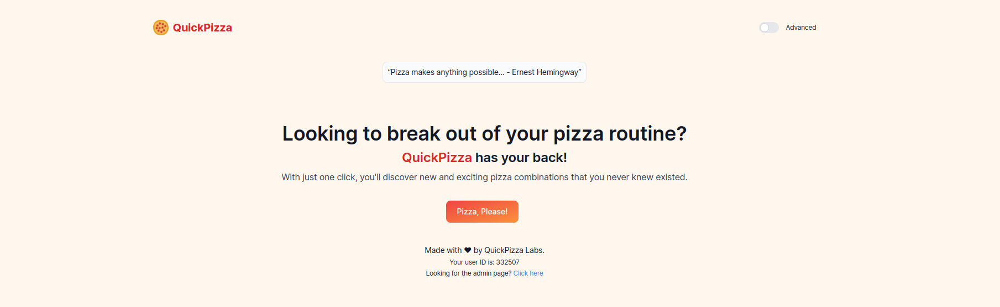
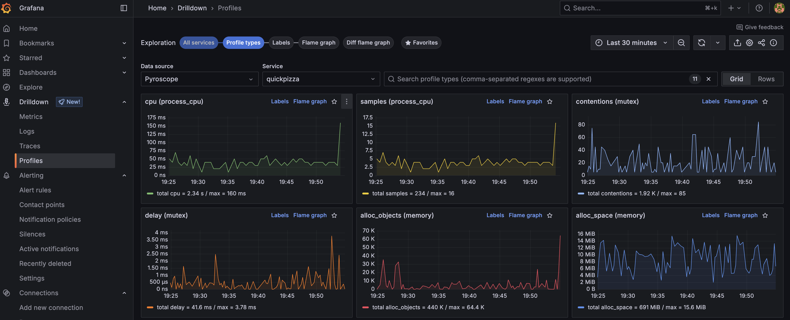
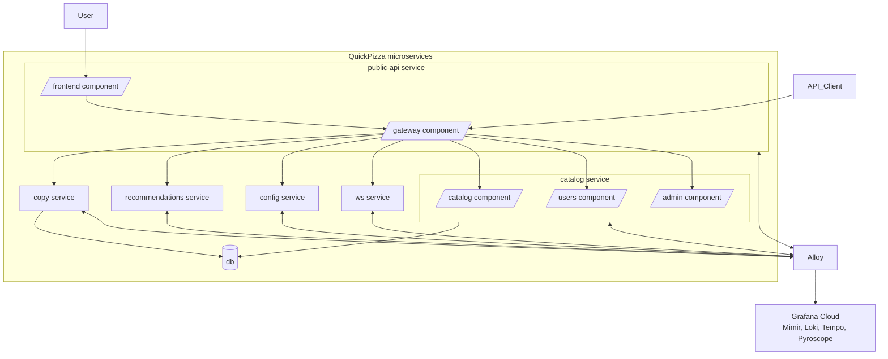
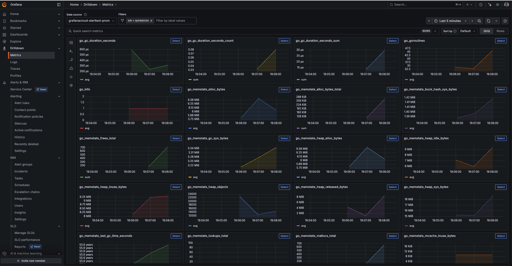
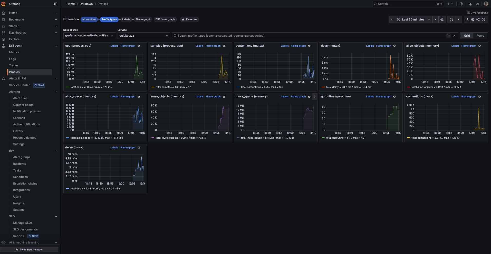
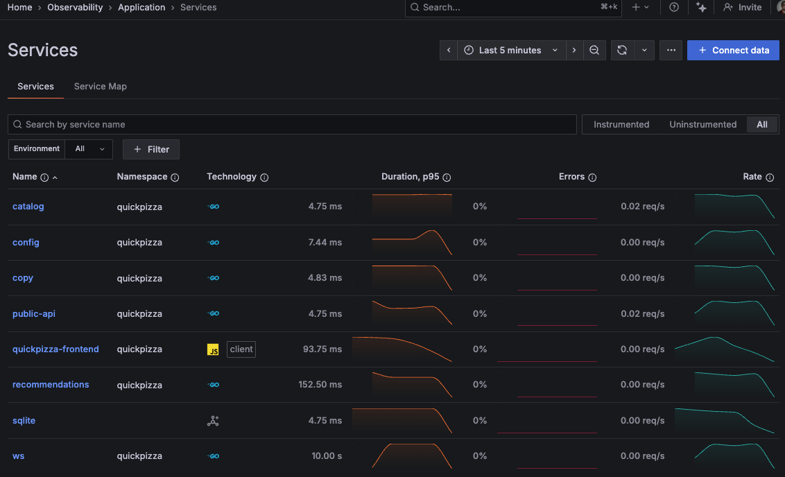
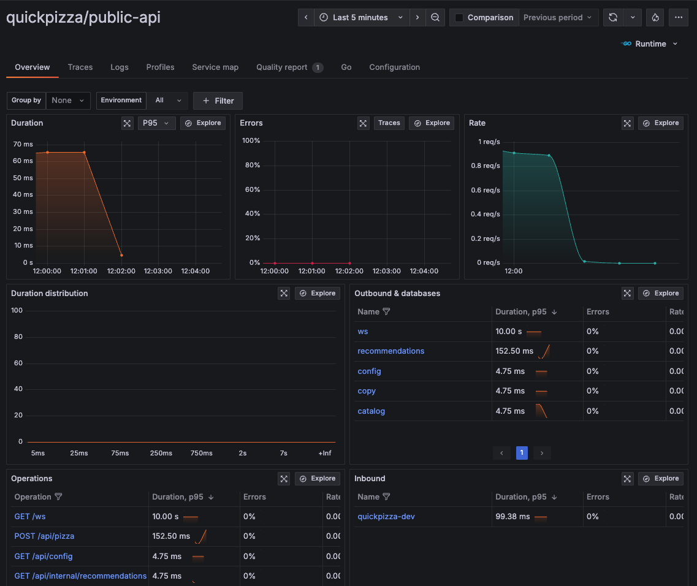
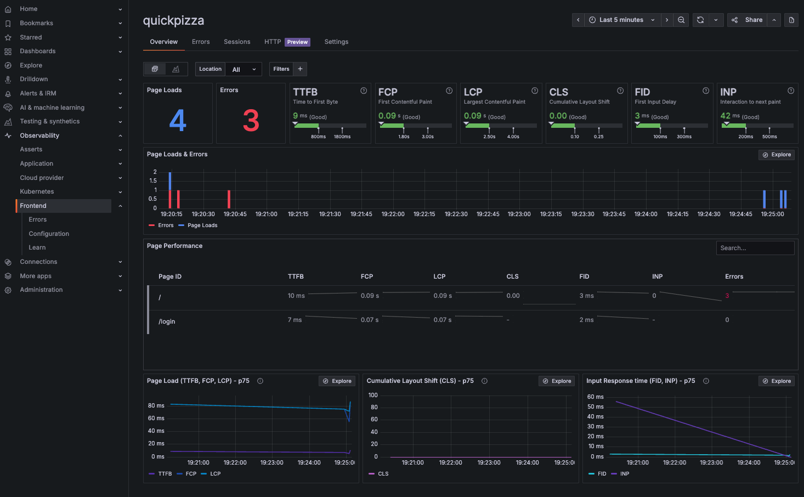

# QuickPizza



- [What is QuickPizza? 🍕🍕🍕](#what-is-quickpizza-)
- [Requirements](#requirements)
- [Use k6 to test QuickPizza](#use-k6-to-test-quickpizza)
- [Run locally with Docker](#run-locally-with-docker)
- [Run and observe locally with Grafana OSS 🐳📊](#run-and-observe-locally-with-grafana-oss-)
- [QuickPizza deployment modes: Monolithic vs Microservices](#quickpizza-deployment-modes-monolithic-vs-microservices)
- [Run locally and observe with Grafana Cloud ☁📊](#run-locally-and-observe-with-grafana-cloud)
  - [Monitor QuickPizza with Grafana Cloud Application and Frontend Observability](#monitor-quickpizza-with-grafana-cloud-application-and-frontend-observability)

## What is QuickPizza? 🍕🍕🍕

**QuickPizza** is a simple web application, used for demonstrations and workshops, that generates new and exciting pizza combinations!

It helps you learn app instrumentation and observability with the Grafana stack, and k6 testing from basics to advanced.

You can run QuickPizza locally or deploy it to your own infrastructure. For demo purposes, QuickPizza is also publicly available at:
1. [quickpizza.grafana.fun](https://quickpizza.grafana.fun/) — Experience this demo instrumented in Grafana Play. Explore [Application Observability](https://play.grafana.org/a/grafana-app-observability-app/services?instrumentedFilter=all&sortFilterId=serviceName&var-prometheus=grafanacloud-prom&from=now-30m&to=now&timezone=utc&var-environmentValue=production&var-filterBy=serviceNamespace%7C%3D%7Cquickpizza), [Frontend Observability](https://play.grafana.org/a/grafana-kowalski-app/apps/2410), [Kubernetes Monitoring](https://play.grafana.org/a/grafana-k8s-app/home?from=now-1h&to=now&refresh=1m&var-cluster=%24__all&var-namespace=quickpizza), and more insights in Grafana Play.
2. [quickpizza-demo.grafana.fun](https://quickpizza-demo.grafana.fun/) — Install the [SRE Demo environment](https://grafana.com/docs/grafana-cloud/get-started/#install-demo-data-sources-and-dashboards) to observe this deployment in this [dashboard](https://play.grafana.org/d/d2e206e1-f72b-448c-83d8-657831c2ea6d/).
3. [quickpizza.grafana.com](https://quickpizza.grafana.com/) — Use this environment to run small-scale performance tests like the ones in the [k6 folder](./k6/).


## Requirements

The requirements for QuickPizza depend on your intended use—whether you want to run k6 tests for performance testing, or enable observability with a local or Grafana Cloud observability stack.

- [Grafana k6](https://grafana.com/docs/k6/latest/set-up/install-k6/) (v1.0.0 or higher) to run the k6 tests used in this project to test QuickPizza.
- [Docker](https://docs.docker.com/get-docker/) to run QuickPizza [locally](#run-locally-with-docker).
- [Docker Compose](https://docs.docker.com/get-docker/) to run and instrument QuickPizza, storing metrics, logs, traces, and profiling data using the Grafana Observability stack. You can either [store this data locally](#run-and-observe-locally-with-grafana-oss-) or send it to [Grafana Cloud](#run-locally-and-observe-with-grafana-cloud-️).


## Use k6 to test QuickPizza

All tests live in the `k6` folder. Within this folder, you will find the following folders:

- [foundations](k6/foundations/) - covers the basic functionalities of k6.
- [browser](k6/browser/) - covers the [k6 browser module](https://grafana.com/docs/k6/latest/using-k6-browser/) for browser and web performance testing.
- [extensions](k6/extensions/) - covers basic tests using [k6 extensions](https://grafana.com/docs/k6/latest/extensions/).

To run tests on the `foundations` folder, you can use the following commands:

```bash
cd k6/foundations
k6 run 01.basic.js
```

If QuickPizza is publicly available , then pass the hostname and port through the `BASE_URL` environment variable as follows:

```bash
k6 run -e BASE_URL=https://quickpizza.grafana.com 01.basic.js
```

<details>
  <summary>Using k6 extensions</summary>
  If the test uses an extension, you need to build a k6 binary that includes the required extension/s. For detailed instructions, refer to k6 docs:

  - [Build a k6 binary using Go](https://grafana.com/docs/k6/latest/extensions/build-k6-binary-using-go/)
  - [Build a k6 binary using Docker](https://grafana.com/docs/k6/latest/extensions/build-k6-binary-using-docker/)

  ```bash
  cd k6/extensions

  xk6 build --with xk6-internal=../internal
  ```

  To run the test that uses the `k6/x/internal` module, use  previously created k6 binary in the `k6/extensions` folder:

  ```bash
  ./k6 run 01.basic-internal.js
  ```
</details>

<details>
  <summary>Send k6 test results to Prometheus</summary>

  You can also send k6 metrics to either a local Prometheus instance or Grafana Cloud Prometheus, and visualize the test results in Grafana.

  ```bash
  ./k6 run -o experimental-prometheus-rw 01.basic-internal.js
  ```

  The sections below explain how to observe QuickPizza using either a local Grafana Observability stack or Grafana Cloud.

  For detailed instructions, see [Send k6 Test Results to Prometheus](./docs/send-k6-test-results.md)

</details>

<details>
  <summary>Using k6 Docker image</summary>
  
  If you want to use the [k6 Docker image](https://hub.docker.com/r/grafana/k6) to run k6, you need to run the QuickPizza and k6 containers within the same network.

  First, create a Docker network. Then, run QuickPizza, assigning a hostname and connecting to the created network.

  ```bash
  docker network create quickpizza_network
  docker run --network=quickpizza_network --hostname=quickpizza --rm -it -p 3333:3333  ghcr.io/grafana/quickpizza-local:latest
  ```

  Next, you can use the k6 Docker image to execute the k6 test. Run the k6 Docker container within the same network (`quickpizza_network`) and pass the `BASE_URL` environment variable with the value of the QuickPizza container's hostname as follows:

  ```bash
  docker run -i --network=quickpizza_network -e BASE_URL=http://quickpizza:3333 grafana/k6 run  - <01.basic.js
  ```
</details>


## Run locally with Docker

To run the app locally with Docker, run the command:

```bash
docker run --rm -it -p 3333:3333  ghcr.io/grafana/quickpizza-local:latest
```

or build image from the repo:

```bash
docker run --rm -it -p 3333:3333 $(docker build -q .)
```

That's it!

Now you can go to [localhost:3333](http://localhost:3333) and get some pizza recommendations!


**Testing something you can't observe is only half the fun!** 🔍✨ QuickPizza is instrumented using best practices to record logs, emit metrics, traces and allow profiling. Get ready to dive deep into observability! 🚀

## Run and observe locally with Grafana OSS 🐳📊


The [compose.grafana-local-stack.monolithic.yaml](./compose.grafana-local-stack.monolithic.yaml) file is set up to run and orchestrate the QuickPizza, Grafana, Tempo, Loki, Prometheus, Pyroscope, and Grafana Alloy containers.

Grafana Alloy collects traces, metrics, logs and profiling data from the QuickPizza app, forwarding them to the Tempo, Prometheus and Loki. Finally, you can visualize and correlate data stored in these containers with the locally running Grafana instance.

To start the local environment with the complete observability stack, use the following command:

```bash
docker compose -f compose.grafana-local-stack.monolithic.yaml up -d
```

This setup runs QuickPizza in monolithic mode, where all QuickPizza components run in a single instance.

Like before, QuickPizza is available at [localhost:3333](http://localhost:3333). It's time to discover some fancy pizzas!

Then, you can visit the Grafana instance running at [localhost:3000](http://localhost:3000) and use **Explore** or **Drilldown apps** to access QuickPizza data.



## QuickPizza deployment modes: Monolithic vs Microservices

QuickPizza can be deployed in two modes: monolithic or microservices.

- **Monolithic mode**: All QuickPizza components run inside a single container.
- **Microservices mode**: QuickPizza is split into independent services, each with a clear responsibility (for example, `catalog`, `recommendations`, or `public-api`). Each service runs in its own Docker container.

The microservices architecture demonstrates service-oriented observability patterns, such as distributed tracing, metric labeling per service, and log correlation.



Label and attributes follow OpenTelemetry semantic conventions for service-oriented architectures:


<details>
  <summary>Microservices mode</summary>
  
  Observability labels:
  - `service_namespace=quickpizza`
  - `service_name={catalog, config, public-api, ...}`
  
  OTEL resource attributes:
  - `service.namespace=quickpizza`
  - `service.name={catalog, config, public-api, ...}`
</details>

<details>
  <summary>Monolithic mode</summary>
  
  Observability labels:
  - `service_namespace=quickpizza`
  - `service_name=quickpizza`
  
  OTEL resource attributes:
  - `service.namespace=quickpizza`
  - `service.name=quickpizza`
  - `service.component={catalog, config, public-api, ...}`
</details>

You can deploy QuickPizza with different Compose files depending on the mode and observability backend:

- [`compose.grafana-local-stack.monolithic.yaml`](./compose.grafana-local-stack.monolithic.yaml): Monolithic mode with a local Grafana observability stack.
- [`compose.grafana-local-stack.microservices.yaml`](./compose.grafana-local-stack.microservices.yaml): Microservice mode with a local Grafana observability stack. 
- [`compose.grafana-cloud.monolithic.yaml`](./compose.grafana-cloud.monolithic.yaml): Monolithic mode with Grafana Cloud.
- [`compose.grafana-cloud.microservices.yaml`](./compose.grafana-cloud.microservices.yaml): Microservice mode with Grafana Cloud.

For microservice deployments, we recommend [monitoring QuickPizza with Application Observability](#monitor-quickpizza-with-grafana-cloud-application-and-frontend-observability), which allows you to easily visualize and correlate data across services.

## Run locally and observe with Grafana Cloud ☁📊

The [compose.grafana-cloud.microservices.yaml](./compose.grafana-cloud.microservices.yaml) file is set up to run QuickPizza in microservice mode with a Grafana Alloy instance.

In this setup, Grafana Alloy collects observability data from the QuickPizza microservices and forwards it to [Grafana Cloud](https://grafana.com/products/cloud/).

You will need the following settings:

1. The name of the [Grafana Cloud Stack](https://grafana.com/docs/grafana-cloud/account-management/cloud-portal/#your-grafana-cloud-stack) where the telemetry data will be stored.
2. An [Access Policy Token](https://grafana.com/docs/grafana-cloud/account-management/authentication-and-permissions/access-policies/) that includes the following scopes for the selected Grafana Cloud Stack: `stacks:read`, `metrics:write`, `logs:write`, `traces:write`, and `profiles:write`.

Then, create an `.env` file with the following environment variables and the values of the previous settings:

```bash
# Your Grafana Cloud Stack Name (Slug)
GRAFANA_CLOUD_STACK=
# Your Grafana Cloud Access Policy Token
GRAFANA_CLOUD_TOKEN=
```

Finally, execute the Docker Compose command using the `compose.grafana-cloud.microservices.yaml` file, just as in the local setup:

```bash
docker compose -f compose.grafana-cloud.microservices.yaml up -d
```

QuickPizza is available at [localhost:3333](http://localhost:3333). Click the `Pizza, Please!` button and discover some awesome pizzas!

Now, you can log in to [Grafana Cloud](https://grafana.com/products/cloud/) and use **Explore** or **Drilldown apps** to access QuickPizza's telemetry data.






### Monitor QuickPizza with Grafana Cloud Application and Frontend Observability

The Docker Compose setup is fully instrumented out of the box, so you can jump right into Grafana Cloud Observability apps and start observing the inner workings of the QuickPizza service components.

To enable [Grafana Cloud Application Observability](https://grafana.com/docs/grafana-cloud/monitor-applications/application-observability/) for QuickPizza:

1. In your Grafana Cloud instance, navigate to **Observability > Application**.
2. Click on **Enable metrics generation** to enable the usage of Application Observability. 
3. Interact with the QuickPizza app to generate traffic. After a few minutes, the QuickPizza components will be automatically discovered and displayed in the UI.





To enable [Grafana Cloud Frontend Observability](https://grafana.com/docs/grafana-cloud/monitor-applications/frontend-observability/):

1. In Grafana Cloud, create a new Frontend Observability application and set the domain to `http://localhost:3333`.
2. Copy the application's Faro web URL.
3. In your `.env` file, add the following environment variables to configure your Faro URL and application name:

    ```bash
    # FRONTEND OBSERVABILITY URL
    QUICKPIZZA_CONF_FARO_URL=

    # FRONTEND OBSERVABILITY APPLICATION NAME
    QUICKPIZZA_CONF_FARO_APP_NAME=
    ```

4. Restart the `compose.grafana-cloud.microservices.yaml` environment:

    ```bash
    docker compose -f compose.grafana-cloud.microservices.yaml down
    docker compose -f compose.grafana-cloud.microservices.yaml up -d
    ```


