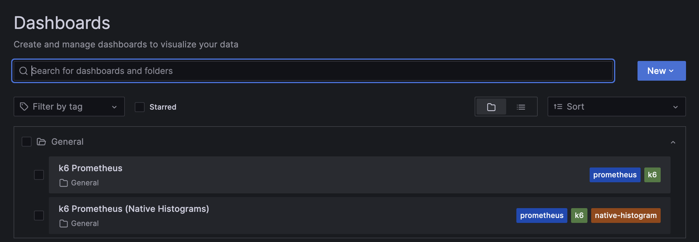

# QuickPizza


## What is QuickPizza? 🍕🍕🍕

**QuickPizza** is a simple web application, used for demonstrations and workshops, that generates new and exciting pizza combinations!


You can run QuickPizza locally or deploy it to your own infrastructure. For demo purposes, QuickPizza is also publicly available at:
1. [quickpizza.grafana.com](https://quickpizza.grafana.com/)— Use this environment to run small-scale performance tests like the ones in the [k6 folder](./k6/).
2. [quickpizza-demo.grafana.fun](https://quickpizza-demo.grafana.fun/) — Install the [SRE Demo environment](https://grafana.com/docs/grafana-cloud/get-started/#install-demo-data-sources-and-dashboards) to observe this deployment, or explore it in [Grafana Play](https://play.grafana.org/d/d2e206e1-f72b-448c-83d8-657831c2ea6d/). 

The QuickPizza tests showcase key k6 features, from basic usage to custom modules and extensions.

## Requirements

- [Grafana k6](https://grafana.com/docs/k6/latest/set-up/install-k6/) (v1.0.0 or higher) to run the k6 tests used in this project to test QuickPizza.
- [Docker](https://docs.docker.com/get-docker/) to run QuickPizza [locally](#run-locally-with-docker).
- [Docker Compose](https://docs.docker.com/get-docker/) to run and instrument QuickPizza, storing metrics, logs, traces, and profiling data using the Grafana Observability stack. You can either [store this data locally](#run-and-observe-locally-with-grafana-oss-) or send it to [Grafana Cloud](#run-locally-and-observe-with-grafana-cloud-️).


## Use k6 to test QuickPizza

All tests live in the `k6` folder. Within this folder, you will find the following folders:

- [foundations](k6/foundations/) - covers the basic functionalities of k6.
- [browser](k6/browser/) - covers the [k6 browser module](https://grafana.com/docs/k6/latest/using-k6-browser/) for browser and web performance testing.
- [extensions](k6/extensions/) - covers basic tests using [k6 extensions](https://grafana.com/docs/k6/latest/extensions/).

To run tests on the `foundations` folder, you can use the following commands:

```bash
cd k6/foundations
k6 run 01.basic.js
```

If QuickPizza is publicly available , then pass the hostname and port through the `BASE_URL` environment variable as follows:

```bash
k6 run -e BASE_URL=https://quickpizza.grafana.com 01.basic.js
```

<details>
  <summary>Using k6 extensions</summary>
  If the test uses an extension, you need to build a k6 binary that includes the required extension/s. For detailed instructions, refer to k6 docs:

  - [Build a k6 binary using Go](https://grafana.com/docs/k6/latest/extensions/build-k6-binary-using-go/)
  - [Build a k6 binary using Docker](https://grafana.com/docs/k6/latest/extensions/build-k6-binary-using-docker/)

  ```bash
  cd k6/extensions

  xk6 build --with xk6-internal=../internal
  ```

  To run the test that uses the `k6/x/internal` module, use  previously created k6 binary in the `k6/extensions` folder:

  ```bash
  ./k6 run 01.basic-internal.js
  ```
</details>

<details>
  <summary>Using k6 Docker image</summary>
  If you want to use the [k6 Docker image](https://hub.docker.com/r/grafana/k6) to run k6, you need to run the Quickpizza and k6 containers within the same network.

  First, create a Docker network. Then, run Quickpizza, assigning a hostname and connecting to the created network.

  ```bash
  docker network create quickpizza_network
  docker run --network=quickpizza_network --hostname=quickpizza --rm -it -p 3333:3333  ghcr.io/grafana/quickpizza-local:latest
  ```

  Next, you can use the k6 Docker image to execute the k6 test. Run the k6 Docker container within the same network (`quickpizza_network`) and pass the `BASE_URL` environment variable with the value of the Quickpizza container's hostname as follows:

  ```bash
  docker run -i --network=quickpizza_network -e BASE_URL=http://quickpizza:3333 grafana/k6 run  - <01.basic.js
  ```
</details>


## Run locally with Docker

To run the app locally with Docker, run the command:

```bash
docker run --rm -it -p 3333:3333  ghcr.io/grafana/quickpizza-local:latest
```

or build image from the repo:

```bash
docker run --rm -it -p 3333:3333 $(docker build -q .)
```

That's it!

Now you can go to [localhost:3333](http://localhost:3333) and get some pizza recommendations!


**Testing something you can't observe is only half the fun!** 🔍✨ QuickPizza is instrumented using best practices to record logs, emit metrics, traces and allow profiling. Get ready to dive deep into observability! 🚀

## Run and observe locally with Grafana OSS 🐳📊


The [docker-compose-local.yaml](./docker-compose-local.yaml) file is set up to run and orchestrate the QuickPizza, Grafana, Tempo, Loki, Prometheus, Pyroscope, and Grafana Alloy containers.

Grafana Alloy collects traces, metrics, logs and profiling data from the QuickPizza app, forwarding them to the Tempo, Prometheus and Loki. Finally, you can visualize and correlate data stored in these containers with the locally running Grafana instance.

To start the local environment, use the following command:

```bash
docker compose -f docker-compose-local.yaml up -d
```

Like before, QuickPizza is available at [localhost:3333](http://localhost:3333). It's time to discover some fancy pizzas!

Then, you can visit the Grafana instance running at [localhost:3000](http://localhost:3000) and use **Explore** or **Drilldown apps** to access QuickPizza data.


To find the labels applied to the telemetry data, refer to [local.alloy](./alloy/local.alloy) and [docker-compose-local.yaml](./docker-compose-local.yaml).

### Send k6 Test Results to Prometheus and visualize them in Grafana with prebuilt dashboards

To send k6 results to the Prometheus instance, execute the `k6 run` command with the value of the `output` flag set to `experimental-prometheus-rw` as follows:

```bash
k6 run -o experimental-prometheus-rw 01.basic.js
```

The local Grafana instance includes the [k6 Prometheus](https://grafana.com/grafana/dashboards/19665-k6-prometheus/) and [k6 Prometheus (Native Histogram)](https://grafana.com/grafana/dashboards/18030-k6-prometheus-native-histograms/) dashboards to help visualize, query, and correlate k6 results with telemetry data.



For detailed instructions about the different options of the k6 Prometheus output, refer to the [k6 output guide for Prometheus remote write](https://grafana.com/docs/k6/latest/results-output/real-time/prometheus-remote-write/).

## Run locally and observe with Grafana Cloud ☁📊

The [docker-compose-cloud.yaml](./docker-compose-cloud.yaml) file is set up to run the QuickPizza and Grafana Alloy containers.

In this setup, Grafana Alloy collects observability data from the QuickPizza app and forwards it to [Grafana Cloud](https://grafana.com/products/cloud/).

You will need the following settings:

1. The name of the [Grafana Cloud Stack](https://grafana.com/docs/grafana-cloud/account-management/cloud-portal/#your-grafana-cloud-stack) where the telemetry data will be stored.
2. An [Access Policy Token](https://grafana.com/docs/grafana-cloud/account-management/authentication-and-permissions/access-policies/) that includes the following scopes for the selected Grafana Cloud Stack: `stacks:read`, `metrics:write`, `logs:write`, `traces:write`, and `profiles:write`.

Then, create an `.env` file with the following environment variables and the values of the previous settings:

```bash
# Your Grafana Cloud Stack Name (Slug)
GRAFANA_CLOUD_STACK=
# Your Grafana Cloud Access Policy Token
GRAFANA_CLOUD_TOKEN=
```

Finally, execute the Docker Compose command using the `docker-compose-cloud.yaml` file, just as in the local setup:

```bash
docker compose -f docker-compose-cloud.yaml up -d
```

QuickPizza is available at [localhost:3333](http://localhost:3333). Click the `Pizza, Please!` button and discover some awesome pizzas!

Now, you can log in to [Grafana Cloud](https://grafana.com/products/cloud/) and use **Explore** or **Drilldown apps** to access QuickPizza's telemetry data.


To find the labels applied to the telemetry data, refer to [cloud.alloy](./alloy/cloud.alloy) and [docker-compose-cloud.yaml](./docker-compose-cloud.yaml) .

### Monitor QuickPizza with Grafana Cloud Application Observability and Frontend Observability

The Docker Compose setup is fully instrumented out of the box, so you can jump right into Grafana Cloud Observability apps and start observing the inner workings of the QuickPizza service components.

To enable [Grafana Cloud Application Observability](https://grafana.com/docs/grafana-cloud/monitor-applications/application-observability/) for QuickPizza:

1. In your Grafana Cloud instance, navigate to **Observability > Application**.
2. Click on **Enable metrics generation** to enable the usage of Application Observability. 
3. Interact with the QuickPizza app to generate traffic. After a few minutes, the QuickPizza components will be automatically discovered and displayed in the UI.


To enable [Grafana Cloud Frontend Observability](https://grafana.com/docs/grafana-cloud/monitor-applications/frontend-observability/):

1. In Grafana Cloud, create a new Frontend Observability application and set the domain to `http://localhost:3333`.
2. Copy the application's Faro web URL.
3. In your `.env` file, add the following environment variables to configure your Faro URL and application name:

```bash
# FRONTEND OBSERVABILITY URL
QUICKPIZZA_CONF_FARO_URL=

# FRONTEND OBSERVABILITY APPLICATION NAME
QUICKPIZZA_CONF_FARO_APP_NAME=
```

4. Restart the `docker-compose-cloud.yaml` environment:

    ```bash
    docker compose -f docker-compose-cloud.yaml down
    docker compose -f docker-compose-cloud.yaml up -d
    ```


### Send k6 test results to Grafana Cloud Prometheus and visualize them with prebuilt Grafana dashboards

Just like in the local setup, we can output k6 result metrics to a Prometheus instance; in this case, it is provided by our Grafana Cloud Stack.

```bash
K6_PROMETHEUS_RW_USERNAME=USERNAME \
K6_PROMETHEUS_RW_PASSWORD=API_KEY \
K6_PROMETHEUS_RW_SERVER_URL=REMOTE_WRITE_ENDPOINT \
k6 run -o experimental-prometheus-rw script.js
```

For detailed instructions, refer to the [k6 output guide for Grafana Cloud Prometheus](https://grafana.com/docs/k6/latest/results-output/real-time/grafana-cloud-prometheus/).

