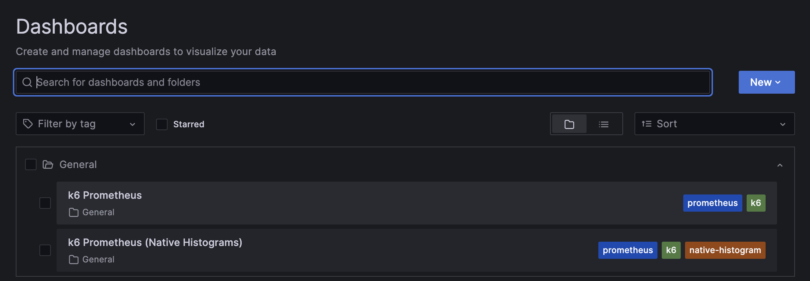

# Send k6 Test Results to Prometheus

You can send k6 test results to a local Prometheus instance or a Grafana Cloud Prometheus instance.

To send k6 results to your local Prometheus instance:

1. Follow the instructions to [run QuickPizza and observe it locally with Grafana OSS](../README.md).

2. Execute the `k6 run` command with the value of the `output` flag set to `experimental-prometheus-rw` as follows:

	```bash
	k6 run -o experimental-prometheus-rw 01.basic.js
	```

The local Grafana instance includes the [k6 Prometheus](https://grafana.com/grafana/dashboards/19665-k6-prometheus/) and [k6 Prometheus (Native Histogram)](https://grafana.com/grafana/dashboards/18030-k6-prometheus-native-histograms/) dashboards to help visualize, query, and correlate k6 results with telemetry data.



For detailed instructions about the different options of the k6 Prometheus output, refer to the [k6 output guide for Prometheus remote write](https://grafana.com/docs/k6/latest/results-output/real-time/prometheus-remote-write/).

To send k6 results to your Grafana Cloud Prometheus instance:

1. Follow the instructions to [observe QuickPizza with Grafana Cloud](../README.md).

2. Run the `k6` execution command as in the local setup, including the additional settings:

	```bash
	K6_PROMETHEUS_RW_USERNAME=USERNAME \
	K6_PROMETHEUS_RW_PASSWORD=API_KEY \
	K6_PROMETHEUS_RW_SERVER_URL=REMOTE_WRITE_ENDPOINT \
	k6 run -o experimental-prometheus-rw script.js
	```

For detailed instructions, refer to the [k6 output guide for Grafana Cloud Prometheus](https://grafana.com/docs/k6/latest/results-output/real-time/grafana-cloud-prometheus/).

