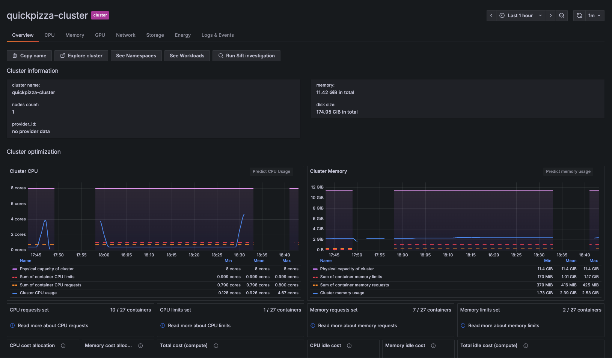

## Enable Grafana Kubernetes Monitoring on the QuickPizza Kubernetes deployment

Here's how to run the Helm monitoring configuration together with QuickPizza:

Deploy QuickPizza following the [Kubernetes deployment instructions](../README.md) using the [`kubernetes/cloud`](../cloud/) setup. 

- Before deployment, set the required credentials in a `.env` file located in the `kubernetes/cloud` folder.

- Deploy the Kubernetes application using `minikube` and `kubectl` instructions.

    ```bash
	minikube start
	cd kubernetes/cloud/
	kubectl apply -k .
    ```

Install the Grafana Kubernetes Monitoring Helm chart.

- Follow the [instructions to enable Kubernetes Monitoring](https://grafana.com/docs/grafana-cloud/monitor-infrastructure/kubernetes-monitoring/configuration/helm-chart-config/) on Grafana Cloud.

- Edit the required environment variables for Kubernetes monitoring on the `.env` files.

- Add the Grafana Helms charts:

    ```bash
    helm repo add grafana https://grafana.github.io/helm-charts
    helm repo update
    ```

- Deploy monitoring using the envsubst command:

    ```bash
	export $(cat .env | xargs)

	helm install grafana-monitoring grafana/k8s-monitoring --values <(envsubst < monitoring.yaml) --create-namespace --namespace monitoring
    ```


Check that all monitoring pods are running:

```bash
kubectl get pods -n monitoring
```

Visit Kubernetes Monitoring to visualize and monitor your Kubernetes cluster:


